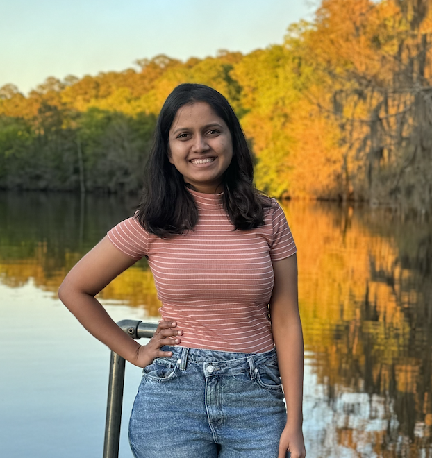

{: class="profile-pic" }

I am a PhD student at the University of Utah, advised by [Prof. Ryan Stutsman](https://www.cs.utah.edu/~stutsman/) in the [Utah Scalable Computer Systems Lab](https://uscs.cs.utah.edu/).

My research interests include:
- Operating Systems
- Distributed Systems
- Storage Systems
- Memory Systems

Feel free to explore my site to learn more about my research, publications, and updates.

